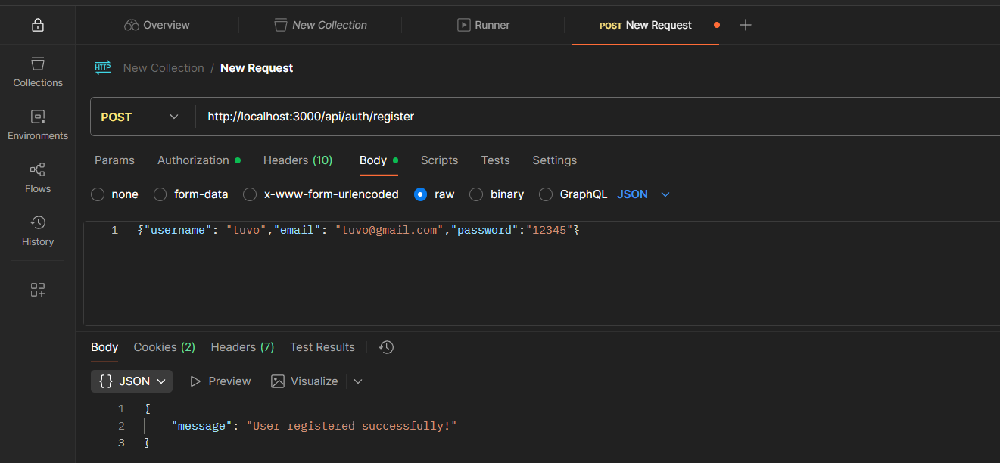
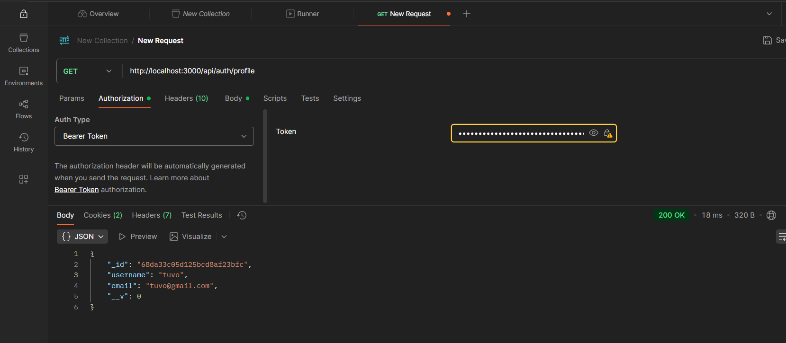
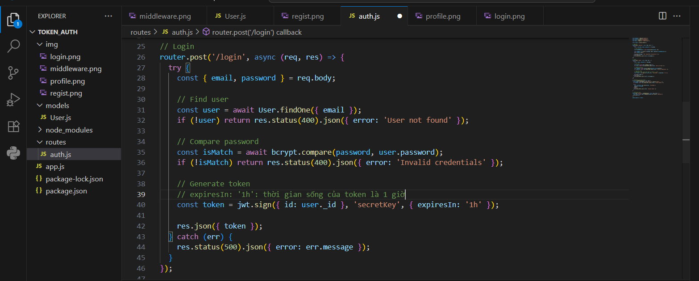
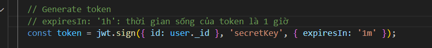
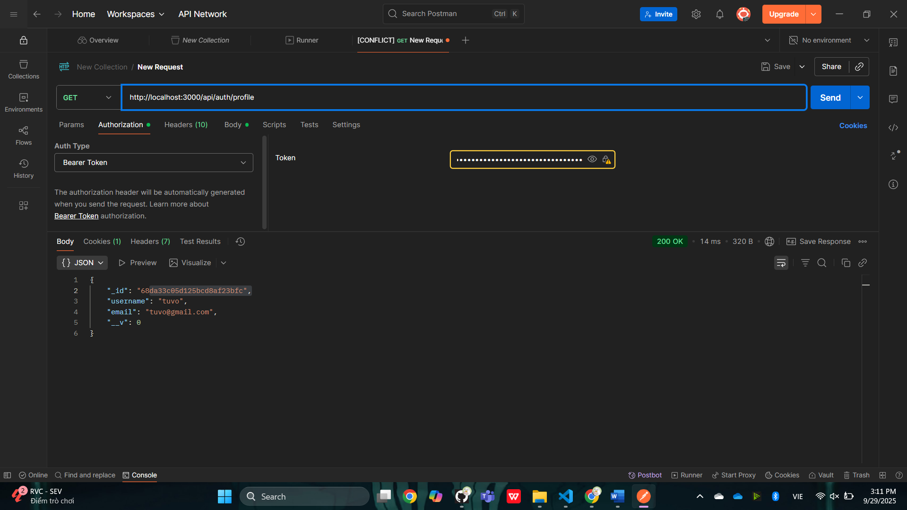

# TOKEN

---

## Run project
```bash
npm install
node app.js
```

---

## Test with Postman

### Register
**POST** `http://localhost:3000/api/register`  
Body:
```json
{"username": "tuvo","email": "tuvo@gmail.com", "password": "123456" }
```
📸 

---

### Login
**POST** `http://localhost:3000/api/login`  
Body:
```json
{ "username": "tuvo", "password": "123456" }
```
- Sau khi đăng nhập thì sẽ sinh ra mã token và token này được xem như là chữ ký của server.
- Các thao tác người dùng khi truy cập dữ liệu phải có mã token này đi kèm thì mới có thể thực hiện được
📸 

---

### Profile
**POST** `http://localhost:3000/api/login`  
Body:
```json
{ "email": "tuvo@gmail.com", "password": "123456" }
```
- Chỉ có thể truy cập dữ liệu thông tin người dùng khi có mã token
📸 

### Kiểm tra xem chữ ký có được thay đổi theo thời gian không
Trong mục router, file auth.js phần login có set cho mã token khi sinh ra có thời gian là 1h.
- Mã token được tạo bởi seret key và thuật toán mã hóa Base_64
📸 
- Để thử xem có hoạt động hay không ta điều chỉnh thời gian sống của token thành 1 phút
📸 
- Thử login và nhập với mã token được sinh ra khi login trong thời gian token sống và có thể truy cập vào dữ liệu người dùng ở bảng users trong database
📸 
- Sau khi hết thời gian sống của token thì ta không thể truy cập được vào dữ liệu nữa
📸 

# Tổng kết
- Mã token giúp ta bảo mật dữ liệu dễ dàng hơn.
- Không thể đánh mất "secret key" vì khi đánh mất thì hacker có thể truy suất được toàn bộ dữ liệu trong hệ thống
 

---

## 📘 Author
**22670361 - Võ Thị Cẩm Tú**
