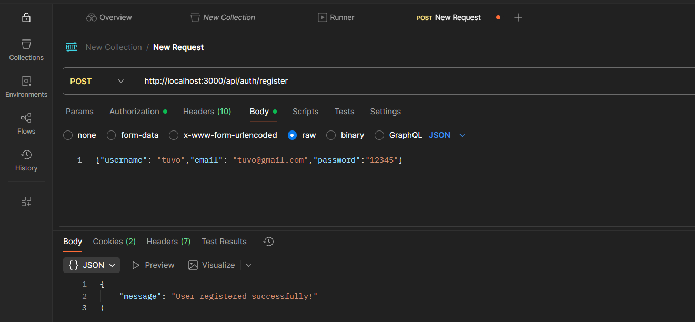
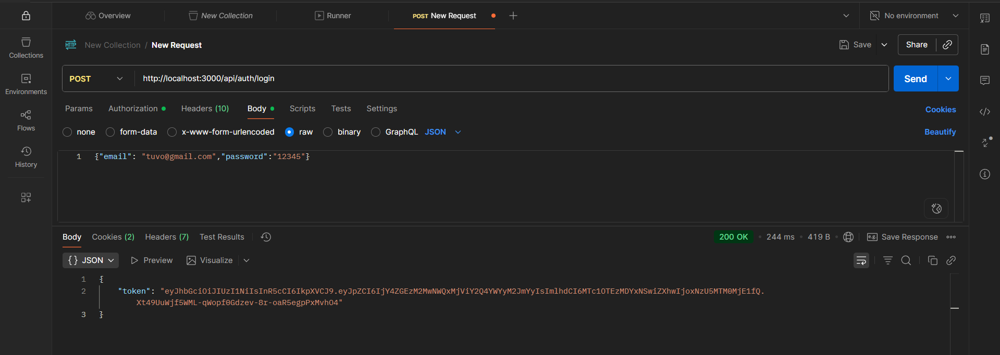
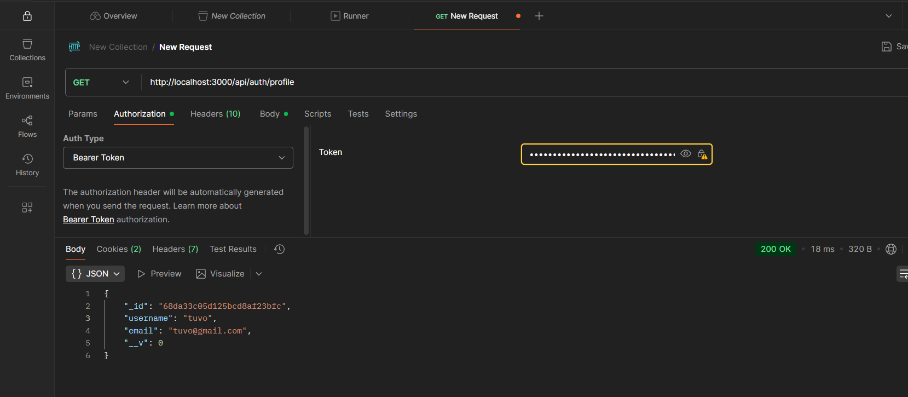
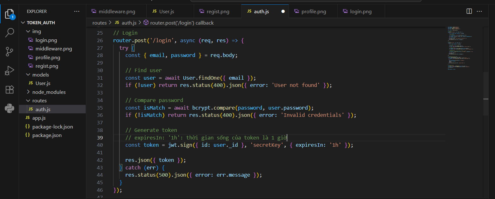
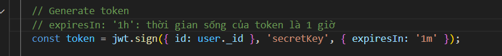
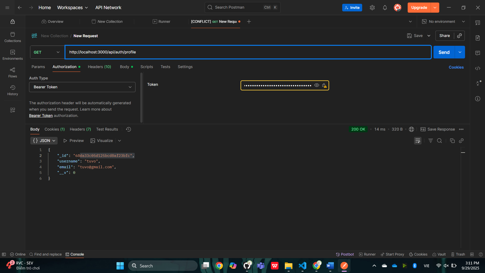
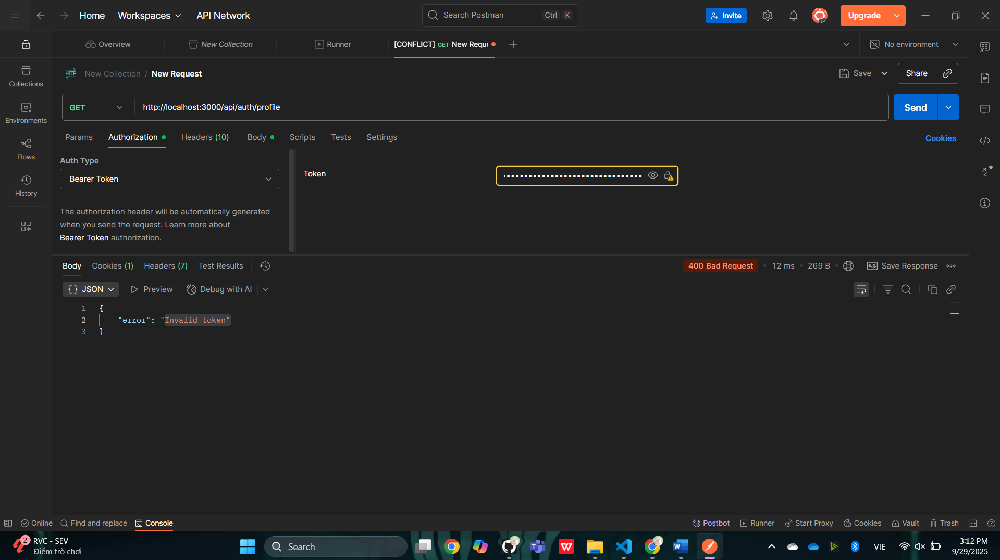

# LOCAL PASSPORT AUTH SERVICE

## 🧩 Description
Thực hành xác thực người dùng bằng **Passport Local Strategy (API)** trong NodeJS.

---

## ⚙️ Run project
```bash
npm install
node app.js
```

---

## 🧪 Test with Postman

### Register
**POST** `http://localhost:3000/api/register`  
Body:
```json
{"username": "tuvo","email": "tuvo@gmail.com", "password": "123456" }
```
📸 

---

### Login
**POST** `http://localhost:3000/api/login`  
Body:
```json
{ "username": "tuvo", "password": "123456" }
```
📸 

---

### Profile
**POST** `http://localhost:3000/api/login`  
Body:
```json
{ "email": "tuvo@gmail.com", "password": "123456" }
```
📸 

### Kiểm tra xem chữ ký có được thay đổi theo thời gian k
**POST** `http://localhost:3000/api/login`  
Body:
```json
{ "username": "tuvo", "password": "123456" }
```

📸 
📸 
📸 
📸 

---

## 📘 Author
**22670361 - Võ Thị Cẩm Tú**
